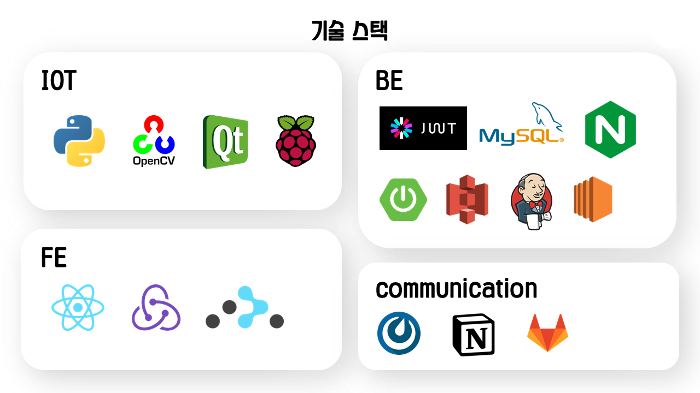
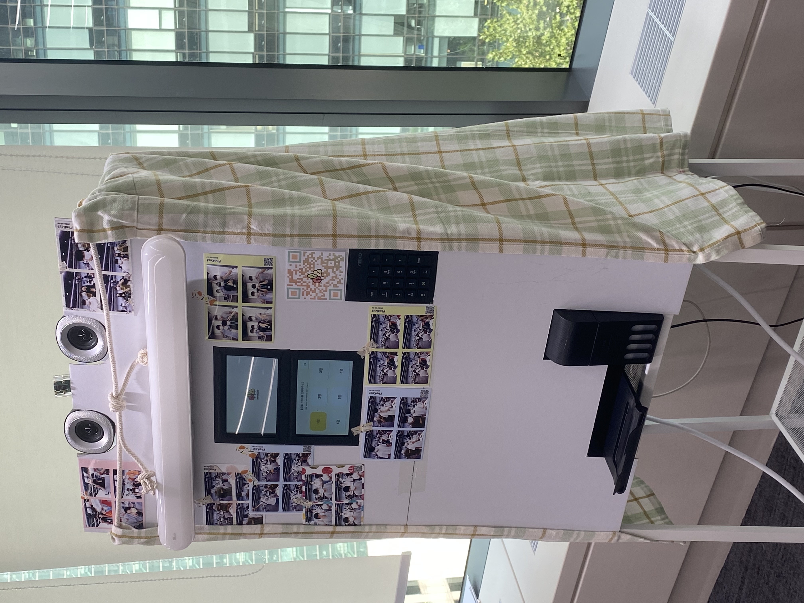
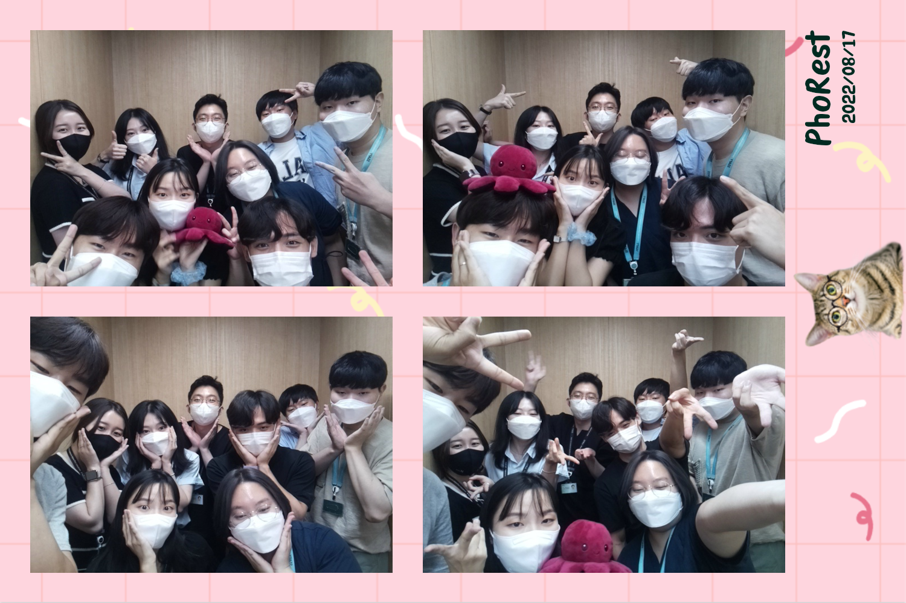

# PhoRest

## 1. 프로젝트 소개

>  Photo + Forest : 추억으로 이루어진 우리들의 사진 숲

여러 기능을 제공하는 웹서비스 그리고 이와 연동된 사진부스 제작 프로젝트

 

## 2. 프로젝트 배경

기존 사진부스를 이용하며 여러가지 불편함을 느낄 수 있었다.

- 사진이 담기는 사진프레임의 종류가 다양하지 않고 직접 만들지 못한다.
- 어떤 포즈를 취해야 좋을지 추천해주지 않는다.

- 분실의 우려처럼 찍은 사진을 관리하기 힘들다.
- 찍었던 사진들을 기록하거나 다른사람과 공유할 커뮤니티의 부재

IoT를 활용한 사진 부스부터 다양한 활동이 가능한 웹페이지까지 제작하여 이러한 불편함을 해소한 서비스를 만들게 되었다.

 

## 3. 프로젝트 요약

- 기술 스택

- 아키텍처

- 사진부스

- PhoRest.site 사진

- 결과물 예시

 

## 4. 기대효과 및 발전가능성

- 기대 효과

  1. 사용자 편리성 증가 : 사진 촬영시 포즈 추천 게시물을 참고 가능하며 직접 제작하거나 남이 만들 프레임으로 사진을 출력 할 수 있다.

  2. 추가적인 요소 제공 : 사진촬영으로 끝나는 것이 아니라, 본인이 찍은 사진과 포즈를 공유하고 상대방과 댓글을 주고받거나 팔로우하기, 프레임 만들기, AR확인하기 등의 기능을 즐길 수 있다.
  3. 본인이 촬영했던 사진들을 쉽게 관리 : 본인의 사진을 한눈에 파악 가능하고 사진을 잃어버려도 걱정할 필요가 없다.

- 발전 가능성

  1. AR 완벽 구현 : 현재 이미지를 트래킹해 동영상을 입히는 AR기술이 완벽하지 않다. 분석을 위한 이미지 변환을 자동으로 진행하는 API가 없어 수동으로 매칭시켜야 하지만, 이를 보완할 경우 사용자에게 디지털과 아날로그 감성이 섞인 색다른 경험을 제공 할 수 있게된다.
  2. 미래로 보내는 메시지 보완 : 카카오톡을 통해 나에게 사진에 대한 메시지를 보낼 수 있다. 하지만 사업자 등록번호가 없어 친구에겐 보내지 못하며, 카카오 로그인 사용자가 아니라면 MMS를 통해 전송된다. MMS를 위한 핸드폰번호 인증도 사업자 번호가 필요하기에 악용될 우려가 있어 이 기능은 막아놓았다.

 

## 4. 팀원 소개 및 담당 역할

- 최희선 (팀장/heesunmelody@gmail.com) : Backend 개발, 프로젝트 관리
- 김준수 (팀원/xofkdqkqh@gmail.com) : Backend 개발
- 김도현 (팀원/kd8317@gmail.com) : Frontend 개발
- 김보경 (팀원/helennaby@gmail.com) : Frontend 개발, 스토리보드 작성, 발표자료 작성 및 발표
- 유현우 (팀원/mansu9801@naver.com) : IoT 개발(키오스크 화면 개발 및 request 개발)
- 윤희욱 (팀원/sosyho@daum.net) : IoT 개발, UCC 영상편집

