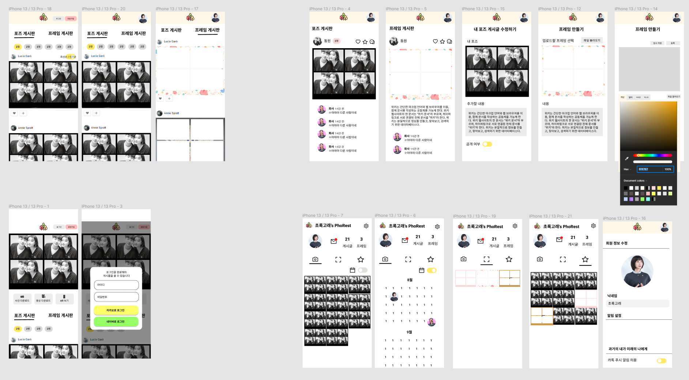
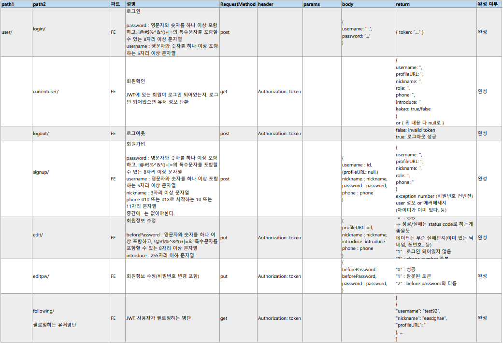
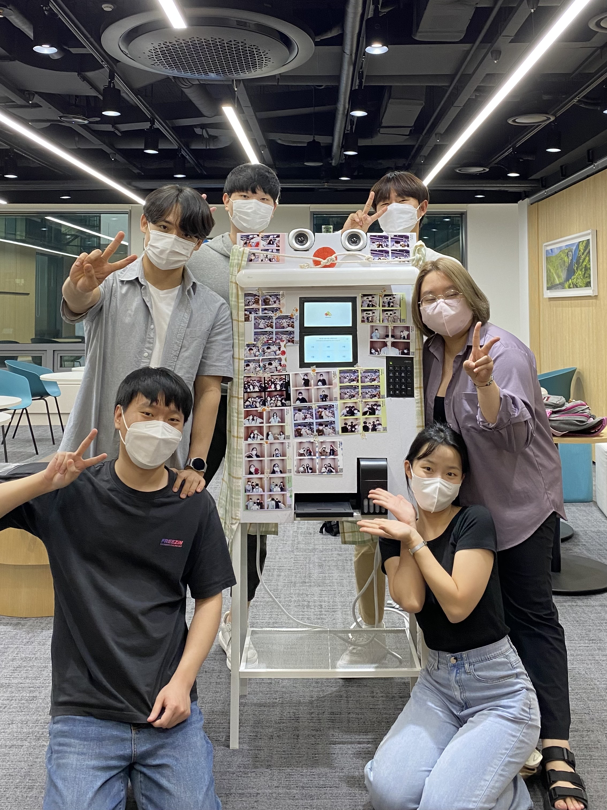

# PhoRest
## 서비스 소개
> Photo + Forest
- 추억으로 이루어진 우리들의 사진 숲    
- 사진부스와 연동된 사진 공유 커뮤니티 서비스
- [~~웹 서비스 바로가기 (phorest.site)~~](https://phorest.site/) <- AWS 비용 문제로 중단
- [UCC 바로가기](https://www.youtube.com/watch?v=T5nlquI3nuw&list=LL&index=9&t=1s)

## 팀원 소개 및 담당 역할
- 최희선 (팀장) : Backend 개발, 프로젝트 관리
- 김준수 (팀원) : Backend 개발
- 김도현 (팀원) : Frontend 개발
- 김보경 (팀원) : Frontend 개발, 발표자료 작성 및 발표
- 유현우 (팀원) : IoT 개발(키오스크 화면 개발 및 request 개발)
- 윤희욱 (팀원) : IoT 개발, UCC 영상편집

## 기술 스택
- IoT : QT, OpenCV, RaspberryPI
- Frontend : React, Redux
- Backend : Spring, MySQL
- Infra : Jenkins, Amazon S3, Nginx

<br>

## 서비스

### 1. 사진 촬영 후 QR로 웹 이동, 본인 사진 편입


### 2. 미래의 나에게 메시지남기기(남에게 보내기는 사업자 등록이 필요)


### 3. 사진 공개 비공개


### 4. 프레임 생성


### 5. AR기능


<br>

## DETAIL

### 0. Conventions

- **git commit message**

  > type: Subject 형태로 작성하기

  type

  - feat: A new feature
  - fix: A bug fix
  - docs: Changes to documentation
  - style: Formatting, missing semi colons, etc; no code change
  - refector: Refactoring production code
  - test: Adding tests, refactoring test; no production code change
  - chore: Updating build tasks, package manager configs, etc; no production code change

  Subject

  - 50자를 넘기지 말 것
  - 대문자로 시작하며 마침표는 적지 않을 것
  - 명령조로 말할것. 예를들면 changed, changes 가 아닌 change

- **GitLab branch 전략**

  - master : 제품으로 출시될 수 있는 브렌치. 최선의 상태 유지
  - study : 프로젝트 기간동안 공부한 내용을 각자 정리하는 브렌치
  - dev : 개발과정에서 fe/be/iot의 코드를 모아 빌드하여 테스트 하는 브렌치
    - feature/(fe, be, iot)/기능명 : 해당 기능 구현을 진행할 때 사용하는 브렌치
  - hotfix : master의 문제를 해결하기 위한 브렌치

- **Jira**

  이슈생성

  - 월요일에 주 단위 스프린트 이슈들을 생성
  - 일주일에 40시간 이상 이슈 생성 및 처리

  이슈 완료

  - 하나의 티켓은 되도록 하나의 커밋으로 처리

- **Style Guide**

  FE

  - var대신 const, let 사용하기
  - 가능한 Arrow Function으로 함수식 작성
  - 변수명 : file_scope 상수는 UPPER_SNAKE_CASE, 그 외엔 camelCase. Boolean변수는 앞에 is 붙이기.
  - 클래스(생성자)명 : 파스칼 케이스를 이용한다. PascalCase
  - 클래스(HTML)명 : 케밥 케이스를 이용한다. kebal-case

  BE

  - 변수명, 인스턴스명: camelCase
  - 상수 변수명(static final): 대문자, 띄어쓰기는 _ 사용
  - 클래스명, 생성자명: PascalCase
  - 함수명: camelCase(동사 + 명사로 구성)
  - Mysql table, column name: snake_case
  - photogroup 은 한단어로 표기하기

<br>

### 1. Planning & Design

- 아이디어 기능 정리


- 와이어 프레임




- ERD


- API




- 아키텍처


<br>

### 2. Development & Test

- FE Directory: pages에서 component 들을 활용하여 페이지 구성, store에서 redux 관리, api에서 request functions 관리

```
├─public
│      favicon.ico
│      index.html
│      manifest.json
│      robots.txt
│
└─src
    │  App.css
    │  App.js
    │  App.test.js
    │  index.css
    │  index.js
    │  reportWebVitals.js
    │  setupTests.js
    │
    ├─api
    │      api.js
    │      community.js
    │      mypage.js
    │      s3.js
    │      user.js
    │
    ├─assets
    │  │  defaultProfile.png
    │  │  img404.png
    │  │  logo.png
    │  │
    │  └─UI
    │          add.png
    │          back.png
    │          ...
    │
    ├─components
    │  ├─Community
    │  │      Comments.css
    │  │      Comments.js
    │  │      CommentsEdit.js
    │  │      CommentsList.js
    │  │      CommentsNew.js
    │  │      CommunityCarousel.css
    │  │      CommunityCarousel.js
    │  │      CommunityListFrame.css
    │  │      CommunityListFrame.js
    │  │      CommunityListPhoto.css
    │  │      CommunityListPhoto.js
    │  │      SharePost.css
    │  │      SharePost.js
    │  │
    │  ├─Layout
    │  │      Footer.css
    │  │      Footer.js
    │  │      Header.css
    │  │      Header.js
    │  │      Layout.css
    │  │      Layout.js
    │  │
    │  ├─MyPage
    │  │      ActivityTabs.css
    │  │      ActivityTabs.js
    │  │      FollowerList.js
    │  │      FollowingList.js
    │  │      MyGallery.js
    │  │      MypageProfile.css
    │  │      MypageProfile.js
    │  │      Search.js
    │  │
    │  ├─ScrollCalendar
    │  │      Calendar.css
    │  │      Calender.js
    │  │      ScrollCalendar.css
    │  │      ScrollCalendar.js
    │  │
    │  ├─User
    │  │      Profile.css
    │  │      Profile.js
    │  │
    │  └─Utils
    │          FloatingBtn.js
    │          ImageEdit.js
    │          ModalBasic.js
    │          ModalConfirm.js
    │          MsgEdit.js
    │          Pagination.js
    │
    ├─pages
    │      Ar.js
    │      Community.css
    │      Community.js
    │      Download.css
    │      Download.js
    │      FrameEdit.css
    │      FrameEdit.js
    │      Kakao.css
    │      Kakao.js
    │      Login.css
    │      Login.js
    │      Main.css
    │      Main.js
    │      MyPage.css
    │      Mypage.js
    │      NotFound404.css
    │      NotFound404.js
    │      ProfileDelete.js
    │      ProfileEdit.css
    │      ProfileEdit.js
    │      ProfileEditPw.js
    │      Signup.js
    │
    └─store
        │  store.js
        │
        └─modules
                community.js
                mypage.js
                user.js
```

- Jenkins: gitlab dev branch에 merge(or push)시 자동 재빌드

- Jira: 주단위로 월요일날 회의를 통해 이슈를 만들고 그 주 금요일 혹은 일요일까지 대부분 완료


<br>

### 3. Opperation

- 약 이틀간 사진부스 사용자를 받고 웹 이용자를 hotjar, google analytics를 통해 확인.
- 다행히? 접수받은 불편사항이 없었다.


<br>

### 4. ETC

[개발일지](./공통프로젝트_개발일지.md)


