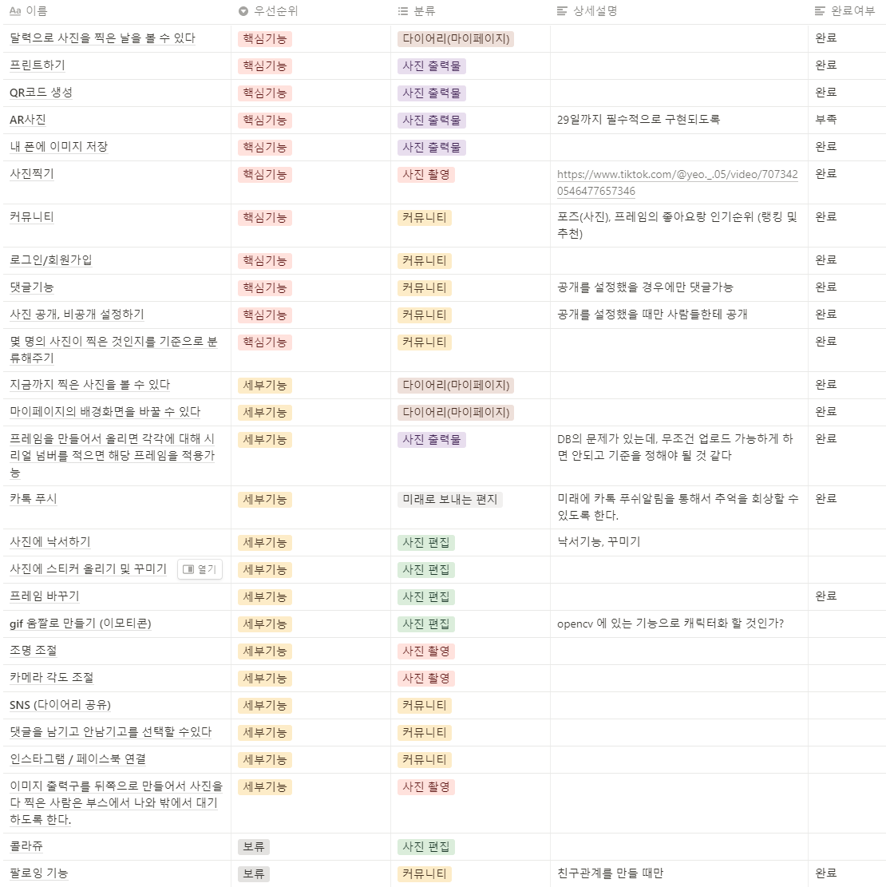
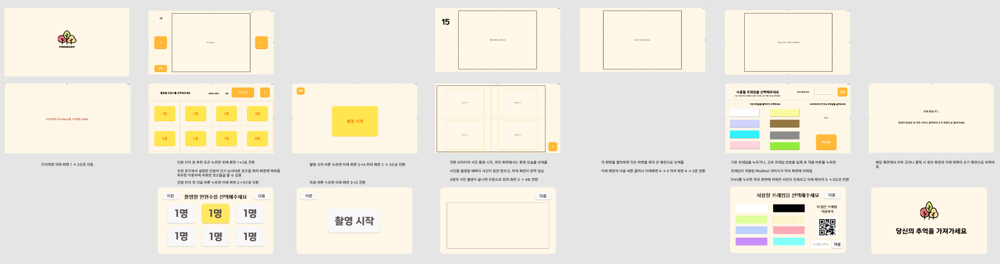
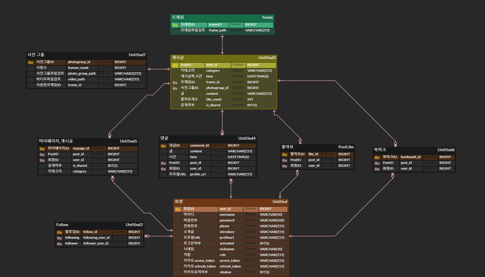
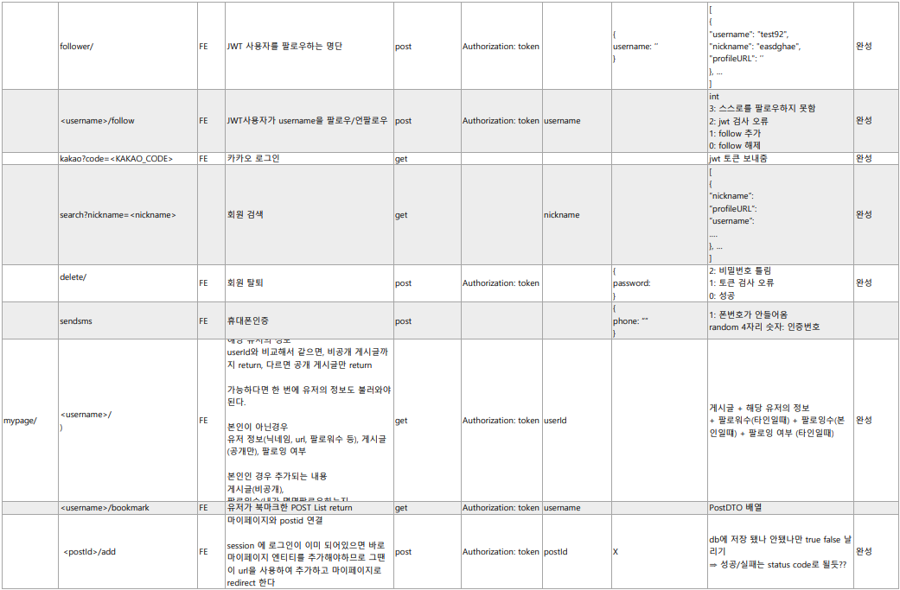
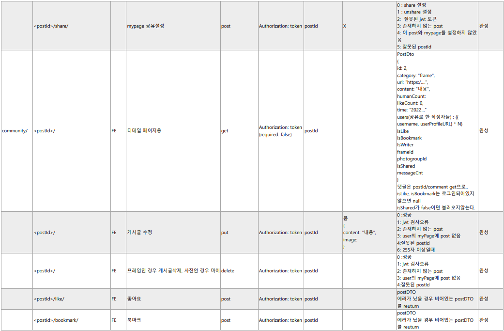
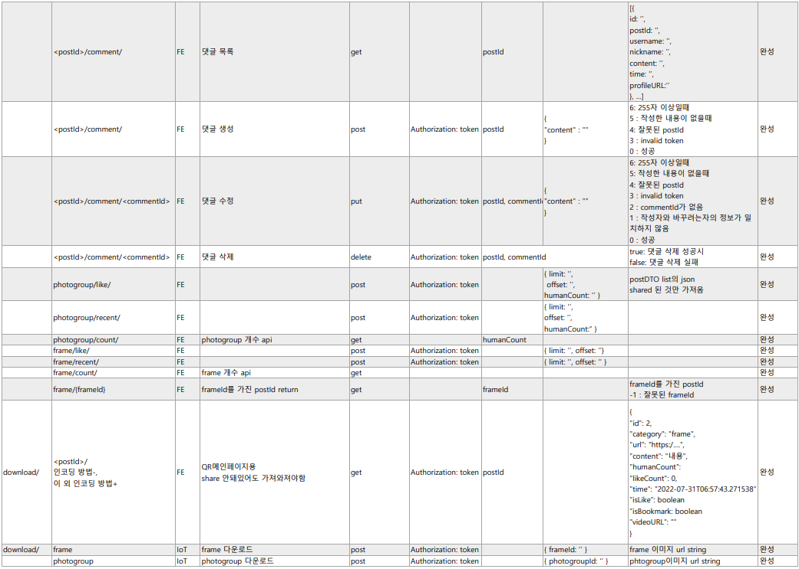
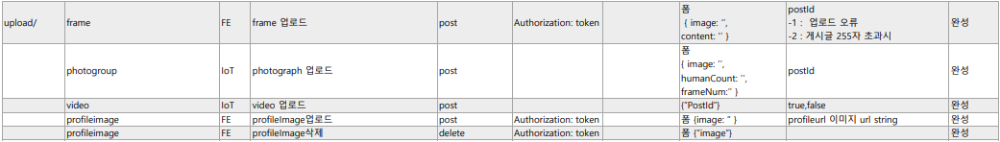
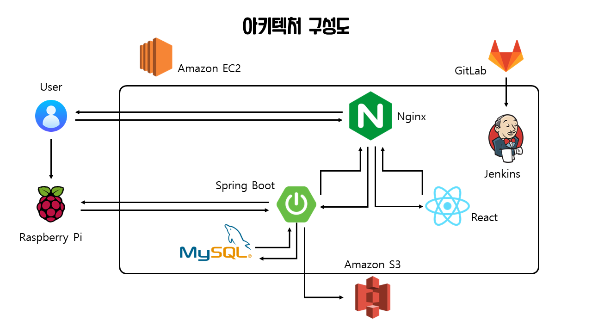
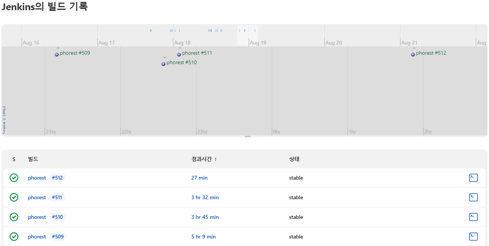
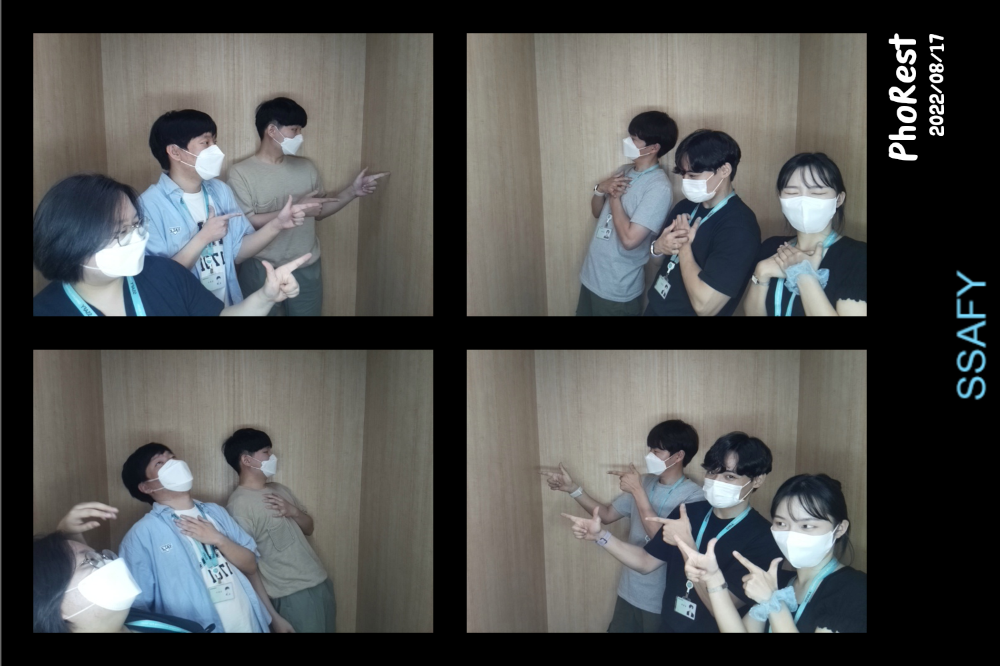

# PhoRest - WIKI

## 0. Conventions

- **git commit message**

  > type: Subject 형태로 작성하기

  type

  - feat: A new feature
  - fix: A bug fix
  - docs: Changes to documentation
  - style: Formatting, missing semi colons, etc; no code change
  - refector: Refactoring production code
  - test: Adding tests, refactoring test; no production code change
  - chore: Updating build tasks, package manager configs, etc; no production code change

  Subject

  - 50자를 넘기지 말 것
  - 대문자로 시작하며 마침표는 적지 않을 것
  - 명령조로 말할것. 예를들면 changed, changes 가 아닌 change

- **GitLab branch 전략**

  - master : 제품으로 출시될 수 있는 브렌치. 최선의 상태 유지
  - study : 프로젝트 기간동안 공부한 내용을 각자 정리하는 브렌치
  - dev : 개발과정에서 fe/be/iot의 코드를 모아 빌드하여 테스트 하는 브렌치
    - feature/(fe, be, iot)/기능명 : 해당 기능 구현을 진행할 때 사용하는 브렌치
  - hotfix : master의 문제를 해결하기 위한 브렌치

- **Jira**

  이슈생성

  - 월요일에 주 단위 스프린트 이슈들을 생성
  - 일주일에 40시간 이상 이슈 생성 및 처리

  이슈 완료

  - 하나의 티켓은 되도록 하나의 커밋으로 처리

- **Style Guide**

  FE

  - var대신 const, let 사용하기
  - 가능한 Arrow Function으로 함수식 작성
  - 변수명 : file_scope 상수는 UPPER_SNAKE_CASE, 그 외엔 camelCase. Boolean변수는 앞에 is 붙이기.
  - 클래스(생성자)명 : 파스칼 케이스를 이용한다. PascalCase
  - 클래스(HTML)명 : 케밥 케이스를 이용한다. kebal-case

  BE

  - 변수명, 인스턴스명: camelCase
  - 상수 변수명(static final): 대문자, 띄어쓰기는 _ 사용
  - 클래스명, 생성자명: PascalCase
  - 함수명: camelCase(동사 + 명사로 구성)
  - Mysql table, column name: snake_case
  - photogroup 은 한단어로 표기하기

 

## 1. Planning & Design

- 아이디어 기능 정리

- 와이어 프레임

- ERD

- API

- 아키텍처

 

## 2. Development & Test

- Directory

- Jenkins

- Jira

 

## 3. Opperation

 

## 4. ETC

