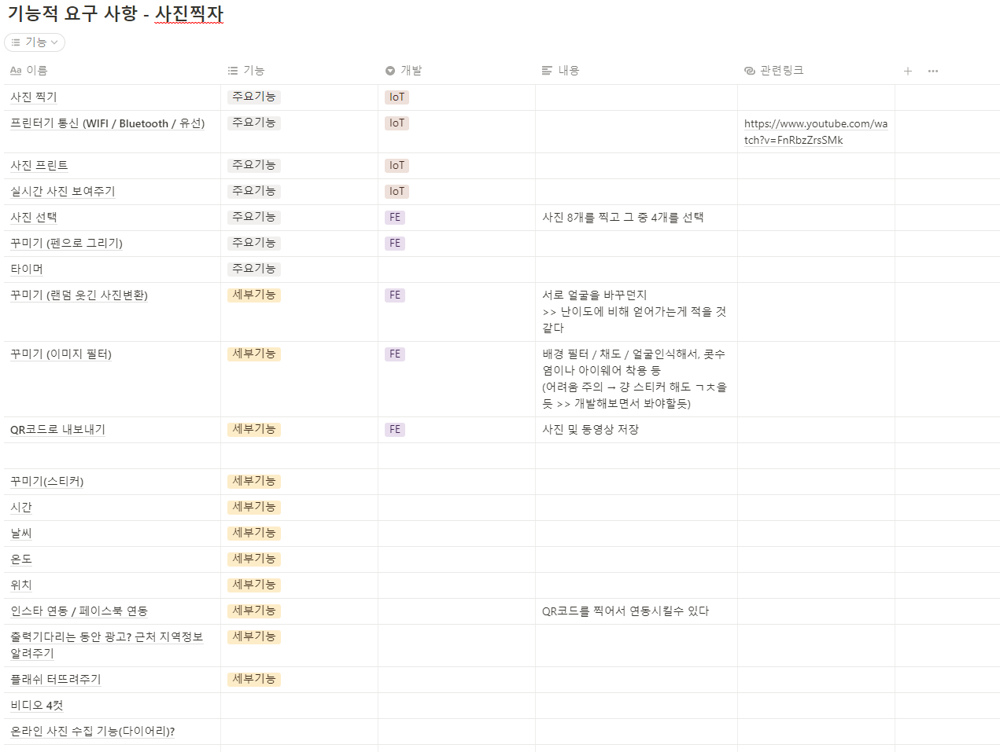

### 2022/07/15 아이디어 회의 내용

- 얼굴형에 따라서 마스크 추천해주기

  https://www.youtube.com/watch?v=UsUHkmaVMOY

  - 한다면 올리브영에서 설치
  - 퍼스널 컬러 + 얼굴형
  - 주관적일 수 있다

- 키오스크에서 커피 비율이나 리터 (우유 시럽 등) 사용자가 정하면 그대로 커피만들어줌

- rgb대로 물감 색 조제

- 발 넣으면 발 치수랑 특징같은거 나오고 알맞은 신발들 추천 : shoepik 어플 (http://shoepik.net/)

  - 위 어플은 사진으로 하는 거라 발등 높이를 알 수 없음

- 혼술할때 같이 짠해주는 로봇(소주는 많으니까 와인?)

  - https://www.wadiz.kr/web/campaign/detail/102450

웹 표현 어려움

- 자동 기타 연주 : https://youtu.be/g_dBuR2GiTA

- 온라인 체스 : 

  https://www.youtube.com/watch?v=CxKnm2DuaEc

  - 모든 말마다 rfid + 체스 판에 rfid 인식기
  - 웹으로 어떻게 연결?

- 비밀 노크로 문열리기 : 

  

  https://www.youtube.com/watch?v=-p_8u_0GNZE

  - 누가 언제 방문했는지 알 수 있다
  - 한다면 방탈출 카페에 납품하자

- 빨래 개주는 기계

- 구피 밥주는 기계

- 야채 넣으면 용도대로 썰어주는 기계 ⇒ 칼이 위험할듯

키오스크

- 키오스크

  | 무슨 키오스크냐? 사용할 때 눈치 안보이고(메뉴같은걸 여유롭게 골라도 아무 문제없는) 처음 사용하는 사람도 편하게 사용할 수 있는 키오스크

  | 어떻게? 두가지 방법으로

  - 하나는 키오스크 자체에서 터치 반응이나 카메라를 통한 연령대파악으로 예상시간 예측, 혹은 키오스크에 아이디나 생체정보를 입력해서 해당 사용자가 이전에 얼마나 오래걸렸는지 파악

    이후에 뒷 사람들에게 오래기다릴 수 있다는걸 신호등처럼 알려주기

  - 두번째는 웹으로 인근 키오스크를 사용할 수 있도록한다. 마치 요기요 포장 주문처럼.

- 시간 맞춰서 커피 내려주기 - 시간맞춰서 자동으로 버튼 누르는 기계?

- 키오스크로 만화추천해주기

  이렇게 비효율적으로 알 필요가 있을까?

- 인생네컷

  - 사진을 찍어서 직접 스티커를 붙이거나 글씨를 쓰거나 꾸밀 수 있다

웹 표현 가능

- 놀이기구 사람들이 줄 서는거 기계가 직접 세서 몇분 기다려야하는지 알려주기
  - 입구보다 더 사람이 많아지면 “2시간 이상” 이라고 써놓기
  - 사람이 더 정확할수도 ㅋ,,
  - 이미 줄 서는 곳에 15분 30분 나와있는데 몇 분이 큰 의미를 가질까,,
- 장신호 확인해서 급똥위험도 알려주는거
  - https://m.blog.naver.com/ideaall/221079821526
- 보고싶은 드라마 선택하면 자동으로 티비 켜지고 채널 설정해주기
- 강아지나 고양이를 밖에서도 쓰다듬어 줄 수있는 손모양 기계
- 쓰레기의 양이 얼마나 차 있는지 알려주는 것
- 공사현장 스마트 헬멧- 심하게 훼손되거나 일정 수준이상의 충격을 감지하면 자동 경고 기능, 열사병 측정해서 위험상황 경고 기능, GPS 기능

앱이 좋을 것 같은 것

- 안경테 추천해주기
  - https://play.google.com/store/apps/details?id=kr.co.deep_eye.rounz_android&hl=ko&gl=US
- 책 넘겨주는 기계/웹에 책갈피/버튼 눌러서 읽으면 넘김 ⇒ ebook
- 스마트홈
  - 차별화하기가 쉽지 않을 거 같다
  - 구현자체도 쉽지 않을 거 같다

점심시간동안 나온 아이디어 정리

- 김치 만들어주는 기계, 배추 속 넣어주는 기계
  - https://www.youtube.com/watch?v=aLYW2Kqs7Og
- 북스캔 쉽게 해주는 기계 (https://youtube.com/shorts/vdFTwfgiSwA?feature=share)
- 스티커사진 + 꾸미기 + 필터 (프리쿠라)
  - 프린터와 블루투스 연결이 가능할가?

---

### 컨설턴트, 코치님 피드백

IoT/Web 강점이 없다 >> 센서 쓸까? >> WEB을 강점으로 세울까?

⇒ 둘중에 하나라도 강점을 잡아야함..

날씨에 따라서 배경 다르게 구현

하드웨어의 센서를 활용해서 좀 다르게 하기?

소프트웨어 딥러닝을 통해 뭔가 좀 다르게하기?

차별점을 잡자!!!!!!!!!!!!!!!!!!!!!!!!!!!!!!! >> 요게 중요

매리트가 있어야뎀!!! 이거 할라고 여기로 찍으러가는거임 << 이런거 있어야뎀

🔥 노력대비 결과의 완성도와 매력도가 확실하지 않다.

사진 같은거 그냥 솔직히 스티커 드래그 앱 드롭 하는거랑 얼굴 인식해서 스티커 올리는 거 사용자가 보기에는 별 차이 없다…

4D 4컷사진관

→ 유지보수가….. 금방 고장날듯

컨셉에는 동의 재밌을 거 같다 → 시야를 틀어보자 → 인생네컷 이외에 우리가 할 수 있는 새로운 뷰를 찾아보자!!! → 각도에 따라서 움직이는 사진(? 인화지?) → 사진을 찍는 과정이 담겨있는 QRcode (사진을 찍기 위해 준비하는 우리의 모습)

사진찍으면 인화해서 보내주는 서비스같은 느낌?! `시점, 아이템, 장소, 소재`를 다양하게 바꿔보자 계속 틀어보자 → 그러면 인생네컷과 다른 것이 나올것같다 (초저전력 디스플레이?), 각도에 따라 다르게 보이는 종이?! 움직이는 책? 프레임별로 사진해가지고~

안된다고 생각하지 말고 할 수 있는 것을 (동영상 출력되는거)

이마트 가격표 종이가 아니다?!?! 초저전력 디스플레이 와우 → 이와 같은 재밌는 아이디어 가보자

웹을 원격으로 생각해라? ⇒ 인형뽑기를 키보드로 조작,,,, 그걸 벤치마크해볼까?

사진을 다른곳에서 찍는데 프린트가 다른데서 된다.

재밌어보인당!~!! 전시될거같당~~!!~!

