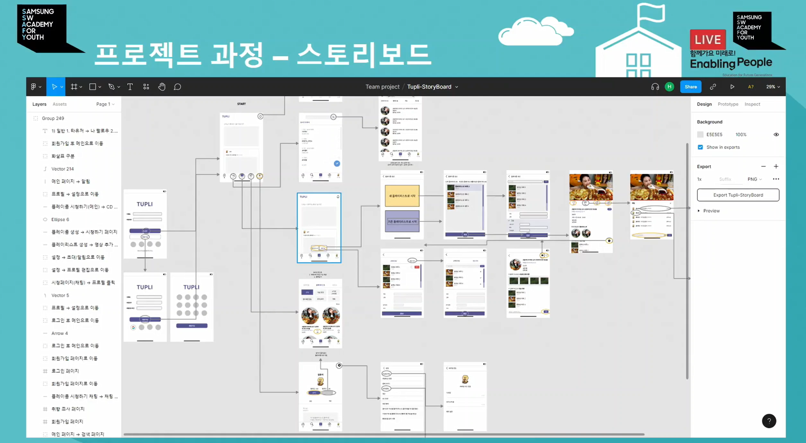
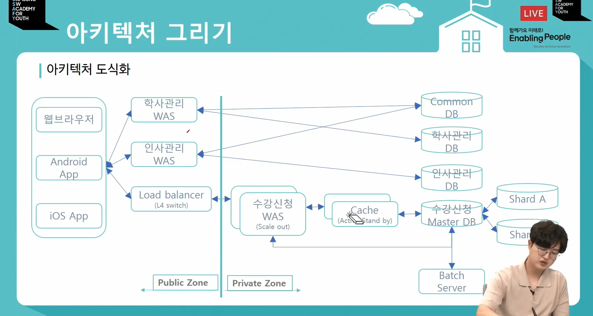
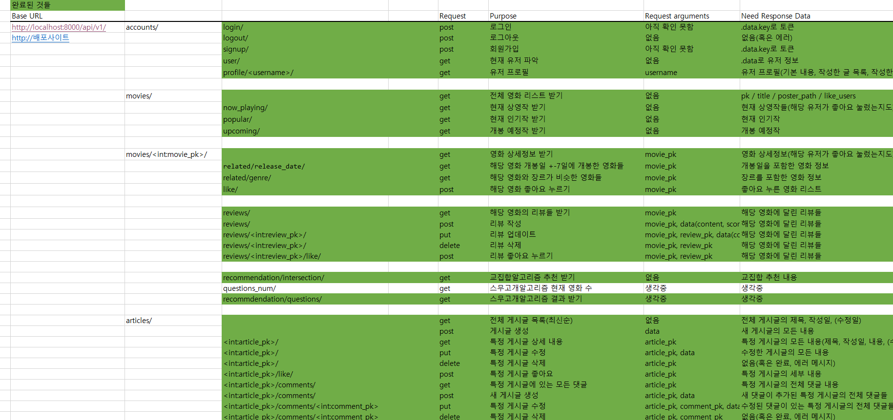
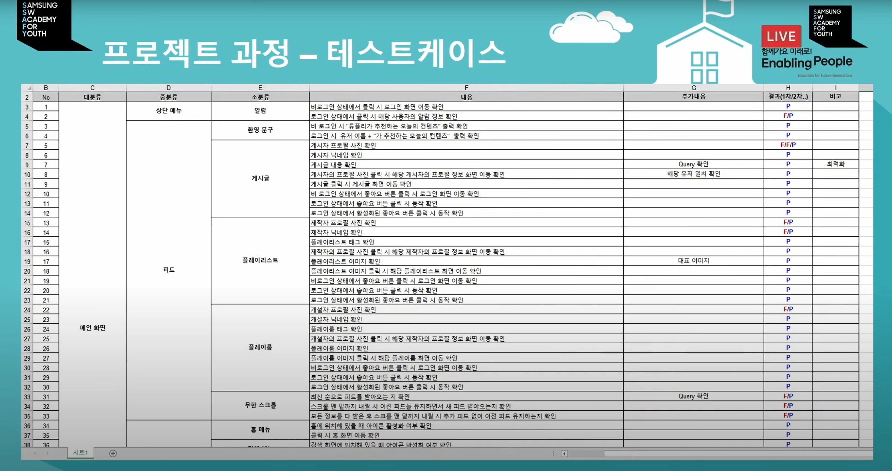

### 문서화 할 것 정리

- 회의록(기획 및 설계, 개발, 테스트, 운영 및 배포)

  데일리 스크럼, 회의내용, 개인개발일지 등을 작성

  툴 : Notion

  

- 스토리보드/와이어프레임(기획 및 설계)

  UI/UX 및 기능 설계

  툴 : Figma, Miro

  

  

  

- 기능 명세서(기획 및 설계)

  구현할 기능을 세부적으로 나누고 우선순위, 명세 등을 서술

  툴 : Notion

  

  

- 아키텍처(기획 및 설계)

  사용 기술들과 사용하는 단위, 규격 정리

  툴 : PPT(?)

  

  

- API(기획 및 설계)

  REST API를 위한 URL, 요청 method, 목적 등을 정리

  툴 : 엑셀, 이후 Swagger 추가

  

  

- ERD(기획 및 설계)

  DB schema 를 위한 ERD 제작

  툴 : ERD Cloud

  

  

- 테스트케이스(테스트)

  각 기능별 상세 테스트케이스 내용과 실시 결과 정리

  툴 : 엑셀

  

### 컨벤션 필요한것들

- git commit

  깃 커밋메시지를 어떤 양식으로 작성할 것인가. 보편적으로 사용하는 내용들을 바탕으로 우리끼리의 약속이 필요하다.

- jira issues

  지라 이슈생성 단위스케일이나 이름 등 약속 필요

- code style guide

  협업시 python pep8 처럼 언어별 대표적인 style guide를 따르도록 숙지 필요

- Matter most(나중에 문서화는 어렵지만, 코치님 교수님들과 소통하기위해 꼭 써야함)

  A101 : 공지/미팅/전달사항/출결/질의 등

  A101_talk : 교육생 이야기 및 텍스트 논의사항

  A101_archiving : 링크/파일/코드 등 저장 내용

  A101_bot : 지라, 깃 관련 내용 자동보고

  